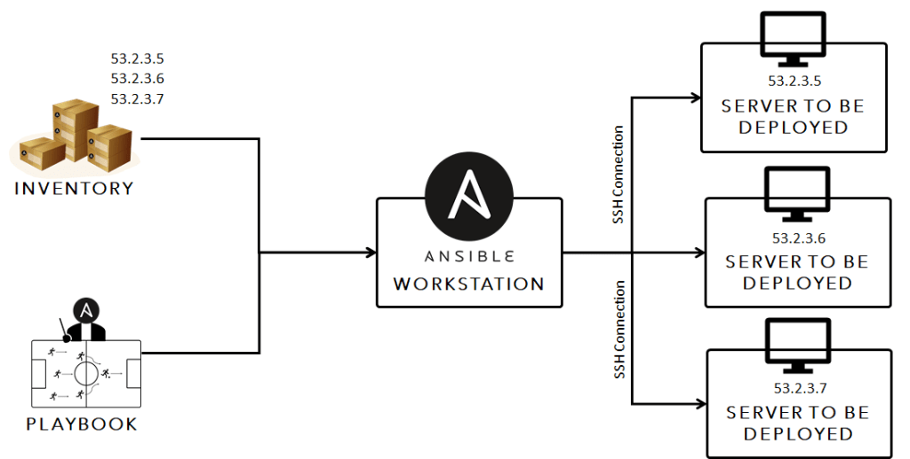
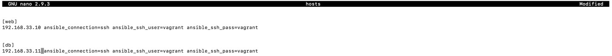
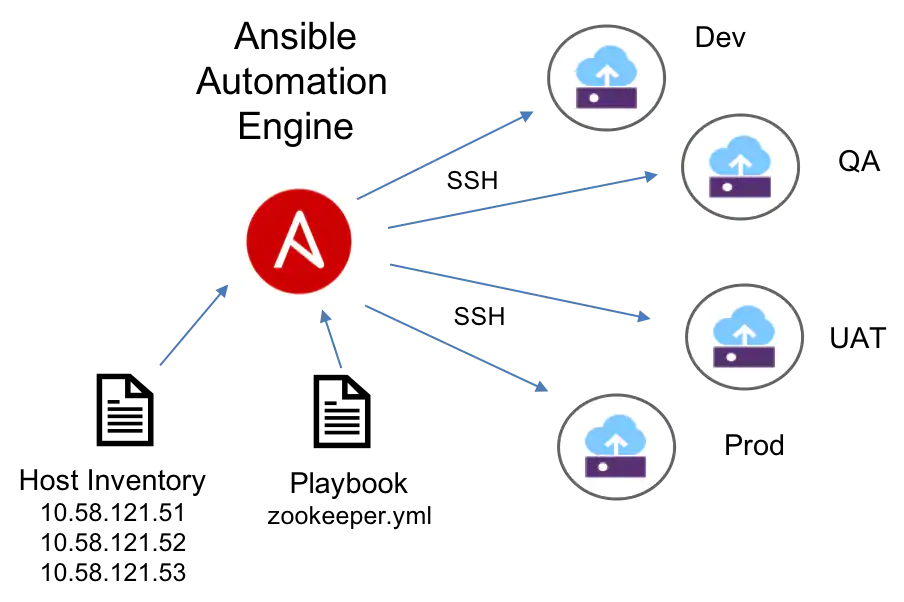

# Ansible



- Ansible is an open-source automation tool, or platform, used for IT tasks such as configuration management, application deployment, intraservice orchestration, and provisioning.
- Ansible allows us to implement IAC (Infrastructure As Code).
  
## Ansible: Local 2 Tier Architecture 
- We will be running three virtual Machines using vagrant where the App, DB and ansible will be running.
- Ansible needs to be configured in Vagrant. Which can be seen below and in the Vagrantfile.
- Vagrant up to the following file. We wi
```vagrant 
Vagrant.configure("2") do |config|

  config.vm.define "web" do |web|
    web.vm.box = "bento/ubuntu-18.04"
    web.vm.hostname = 'web'
    web.vm.network :private_network, ip: "192.168.33.10"                 # IP for Web
    config.hostsupdater.aliases = ["development.web"]  
  end
  
# creating second VM called db
  config.vm.define "db" do |db| 
    db.vm.box = "bento/ubuntu-18.04"
    db.vm.hostname = 'db'
    db.vm.network :private_network, ip: "192.168.33.11"  
    config.hostsupdater.aliases = ["development.db"]     
  end

 # creating are Ansible controller
  config.vm.define "controller" do |controller| 
    controller.vm.box = "bento/ubuntu-18.04"
    controller.vm.hostname = 'controller'
    controller.vm.network :private_network, ip: "192.168.33.12"
    config.hostsupdater.aliases = ["development.controller"] 
  end
end
```
### Controller Machine Configuration

- We install the following dependencies for ansible to work.
- We can check this via `ansible --version`. 
- We can now move on to creating the playbooks to provision the DB and APP machines.
```python
sudo apt-get update
sudo apt-get install software-properties-common
sudo apt-add-repository ppa:ansible/ansible
sudo apt-get update
sudo apt-get install ansible
```
- We have to ensure that the connection between ansible, and the th other two machines are established.
- We do this by changing the Hosts settings which can be found via `cd /etc/ansible`
- Configure hosts, so it looks like the following where a ssh is established.



- We can test to see if the connection has been established. Type the command `ansible all -m ping`.
- The outcome will show success if done correctly.

### Setting Connections to DB and Web

- To connect our DB and Web we need to enter the hosts file and change the configuration.
- We know that our web virtual machine has an IP of 19.168.33.10.
- We know that our db virtual machine has an Ip of 192.168.33.11.
- We go into hosts and enter the following.

```python
[web]
19.168.33.10 ansible_connection=ssh ansible_ssh_user=vagrant ansible_ssh_pass=vagrant

[db]
19.168.33.11 ansible_connection=ssh ansible_ssh_user=vagrant ansible_ssh_pass=vagrant
```
- To check if we can successfully connect to our VM's we should ping them via the command.
`ansible all -m ping`
  
- We can also determine the names of the machines via the command `ansible all -a "uname -a"` or individually via `ansible NAME_IN_HOSTS -a "uname -a"`
- Other command include `ansible all -a "free -m"` to see memor.
- `ansible all -a "date"` to see the date.


### Playbooks (DB and APP)

-  playbook is a blueprint of automation tasks. Ansible's playbooks are executed on a set, group, or classification of hosts, which together make up an Ansible inventory.
- We can install nginx and nodejs on the web server by creating a playbook known as `app_playbook.yml`.
- This will install the nodejs and nginx dependencies on the web virtual machines. 
- We can check this via ` ansible web -m shell -a "systemctl status nginx"` which should show it as active and running.


```python
###### APP PLAYBOOK

---
- hosts: web    # Target web machine
  gather_facts: yes
  become: true     # Give admin access to playbook
  
  # clone repo for app
 - name: Clone a repo with separate git directory
   ansible.builtin.git:
     repo: https://github.com/S-ghanbary98/Jenkins_CICD.git
     dest: /home/vagrant/
     
# installing nginx
  tasks:
  - name: Install Nginx
    apt: pkg=nginx state=present update_cache=yes
-
  name: "NodeJs Installation"
  hosts: web
  become: true
  tasks:
    - name: "add nodejs"
      apt_key:
        url: https://deb.nodesource.com/gpgkey/nodesource.gpg.key
        state: present
    - name: add repo
      apt_repository:
        repo: deb https://deb.nodesource.com/node_13.x bionic main
        update_cache: yes
    - name: "installing nodejs"
      apt:
        update_cache: yes
        name: nodejs
        state: present
- name: "create file"
      file:
        path: /etc/nginx/sites-available/default
        state: touch
        mode: 0644
    - name: "change default file"
      blockinfile:
        path: /etc/nginx/sites-available/default
        block: |
          server{                                          # Reverse proxy Config
            listen 80;
            server_name _;
            location / {
            proxy_pass http://192.168.33.10:3000;
            proxy_http_version 1.1;
            proxy_set_header Upgrade \$http_upgrade;
            proxy_set_header Connection 'upgrade';
            proxy_set_header Host \$host;
            proxy_cache_bypass \$http_upgrade;
            }
          }
      notify:
        - Restart nginx
    - name: update npm
      command: npm install pm2 -g -y
  handlers:
  - name: Restart nginx
    service:
      name: nginx
      state: restarted

- name: "starting app"
  hosts: web
  become: true
  tasks:
    - name: "npm install"
      shell: |
        cd app/
        npm install
        pm2 kill
 
    - name: "starting node.js"
      shell: |
        node Jenkins_CICD/app/seeds/seed.js
        cd app/
        pm2 start app.js
-
  name: "reverse proxy"
  hosts: web
  become: true
  tasks:
    - name: "delete current default"
      file:
        path: /etc/nginx/sites-available/default
        state: absent
```
- The provisioning file for MongoDB can be found below where the following dependencies are installed on the DB machines.


```python
---

- hosts: db
  gather_facts: yes
  become: true
  

  tasks:
  - name: install mongodb
    apt: pkg=mongodb state=present

  - name: Remove mongodb file (delete file)
    file:
      path: /etc/mongodb.conf
      state: absent

  - name: Touch a file, using symbolic modes to set the permissions (equivalent to 0644)
    file:
      path: /etc/mongodb.conf
      state: touch
      mode: u=rw,g=r,o=r

  - name: Insert multiple lines and Backup
    blockinfile:
      path: /etc/mongodb.conf
      backup: yes
      block: |
        "storage:
          dbPath: /var/lib/mongodb
          journal:
            enabled: true
        systemLog:
          destination: file
          logAppend: true
          path: /var/log/mongodb/mongod.log
        net:
          port: 27017
          bindIp: 0.0.0.0"
```
## Ansible: EC2 Creation and Provisioning

- In this task we will be building up our Ansible skills so can deploy the app and mongodb onto ec2 instances using ansible.
- Firstly we need to install a few dependencies and safeguard our keys in a .yml file.

```python
sudo apt-get install python3-pip
sudo pip3 install awscli
sudo pip3 install boto bot3
supo apt-get upgrade -y
sudo apt- update -y
```
- Afterwards create a folder within the /etc/ansible called group_vars via `sudo mkdir group_vars` and another directory called "all".
- To connect to aws we will need our access and secret keys. We will place these in the file knows as pass.yml
- In "all" type the command `ansible-vault create pass.yml` and type your secret and access keys.

```python
aws_access_key: YOUR KEY
aws_scret_key: YOUR SECRET KEY
```
- It's time to create the playbook to create EC2 instances.
- The following file was created below which allows us to configure this playbook.
- The command `ansible-playbook ec2_playbook.yml --ask-vault-pass create_ec2_tag` will then create the EC2.

```python
# AWS playbook
---

- hosts: localhost
  connection: local
  gather_facts: False

  vars:
    key_name: my_aws
    region: us-east-2
    image: ami-0f93b5fd8f220e428 # https://cloud-images.ubuntu.com/locator/ec2/
    id: "web-app"
    sec_group: "{{ id }}-sec"

  tasks:

    - name: Facts
      block:

      - name: Get instances facts
        ec2_instance_facts:
          aws_access_key: "{{ec2_access_key}}"
          aws_secret_key: "{{ec2_secret_key}}"
          region: "{{ region }}"
        register: result

      - name: Instances ID
        debug:
          msg: "ID: {{ item.instance_id }} - State: {{ item.state.name }} - Public DNS: {{ item.public_dns_name }}"
        loop: "{{ result.instances }}"

      tags: always


    - name: Provisioning EC2 instances
      block:

      - name: Upload public key to AWS
        ec2_key:
          name: "{{ key_name }}"
          key_material: "{{ lookup('file', '/Users/julianosilva/.ssh/{{ key_name }}.pub') }}"
          region: "{{ region }}"
          aws_access_key: "{{ec2_access_key}}"
          aws_secret_key: "{{ec2_secret_key}}"

      - name: Create security group
        ec2_group:
          name: "{{ sec_group }}"
          description: "Sec group for app {{ id }}"
          # vpc_id: 12345
          region: "{{ region }}"
          aws_access_key: "{{ec2_access_key}}"
          aws_secret_key: "{{ec2_secret_key}}"
          rules:
            - proto: tcp
              ports:
                - 22
              cidr_ip: 0.0.0.0/0
              rule_desc: allow all on ssh port
        register: result_sec_group

      - name: Provision instance(s)
        ec2:
          aws_access_key: "{{ec2_access_key}}"
          aws_secret_key: "{{ec2_secret_key}}"
          key_name: "{{ key_name }}"
          id: "{{ id }}"
          group_id: "{{ result_sec_group.group_id }}"
          image: "{{ image }}"
          instance_type: t2.micro
          region: "{{ region }}"
          wait: true
          count: 1
          # exact_count: 2
          # count_tag:
          #   Name: App
          # instance_tags:
          #   Name: App

      tags: ['never', 'create_ec2']
```

# Packer

##### What is Packer?
- Packer is an open source tool for creating identical machine images for multiple platforms from a single source configuration. 

### Packer Installation

```python
 curl -fsSL https://apt.releases.hashicorp.com/gpg | sudo apt-key add -
sudo apt-add-repository "deb [arch=amd64] https://apt.releases.hashicorp.com $(lsb_release -cs) main"
sudo apt-get update && sudo apt-get install packer
```

### Building AMI 

- The following template will be used to create an image.

```python
{
  "variables": {
  "aws_access_key": "${AWS_ACCESS_KEY_ID}",
  "aws_secret_key": "${AWS_SECRET_ACCESS_KEY}",
  "vpc_region": "${vpc_region}",
  "vpc_id": "${vpc_id}",
  "vpc_public_sn_id": "${vpc_public_sn_id}",
  "vpc_public_sg_id": "${vpc_public_sg_id}",
  "source_ami": "${source_ami}",
  "instance_type": "${instance_type}",
  "ssh_username": "${ssh_username}"
},
  "builders": [
    {
      "type": "amazon-ebs",
      "access_key": "{{user `aws_access_key`}}",
      "secret_key": "{{user `aws_secret_key`}}",
      "region": "{{user `vpc_region`}}",
      "vpc_id": "{{user `vpc_id`}}",
      "subnet_id": "{{user `vpc_public_sn_id`}}",
      "associate_public_ip_address": true,
      "security_group_id": "{{user `vpc_public_sg_id`}}",
      "source_ami": "{{user `source_ami`}}",
      "instance_type": "{{user `instance_type`}}",
      "ssh_username": "{{user `ssh_username`}}",
      "ami_name": "base-ami-{{isotime \"2006-01-02-1504\"}}",
      "ami_groups": "all",
      "launch_block_device_mappings": [
        {
          "device_name": "/dev/sda1",
          "volume_type": "gp2",
          "volume_size": "30",
          "delete_on_termination": true
        }
      ]
    }
  ],
  "provisioners": [
    {
      "type": "shell",
      "script": "baseInit.sh"
    }
  ],
  "post-processors": [
    {
      "type": "manifest",
      "output": "manifest.json",
      "strip_path": true
    }
  ]
}
```